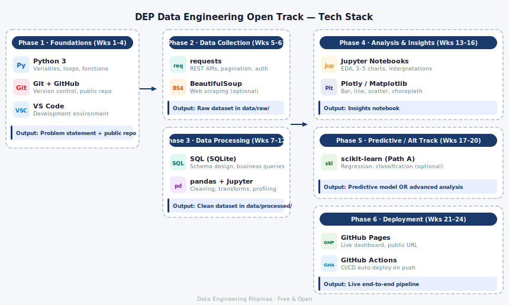

# DEP Data Engineering Open Track: A 6-Month Project-Driven Build Journey

> A 6-month, self-paced, project-driven learning journey. Participants build a real, deployable data project using free and open-source tools.

**Cohort:** June – November 2026 &nbsp;|&nbsp; **Time:** ~5 hrs/week &nbsp;|&nbsp; **Cost:** Free

---

## What You'll Build

By the end of the program, every participant will have:

- A **public GitHub repo** with a clean, documented data project
- A **live deployed dashboard** (GitHub Pages)
- An **end-to-end data pipeline** (ingest → clean → analyze → deploy)

---

## How to Use This Repo

This is the **program hub** — it contains the curriculum, weekly resources, and milestone guides.

**Builders:** Follow the phase folders in order. Each week folder has resources, tasks, and links.

**Volunteers:** See [docs/VOLUNTEER_GUIDE.md](docs/VOLUNTEER_GUIDE.md) for your role and responsibilities.

---

## Stuck Protocol

> If you have spent more than **2 hours** on one problem without progress:
>
> 1. Write down exactly what you tried
> 2. Post in the DEP community channel with your error message and code snippet
> 3. Tag your moderator
>
> **Do NOT skip ahead.** Moderators flag stuck participants for Ops Lead review within 48 hours.
> You may not advance to the next milestone while a blocker is unresolved.

---

## Curriculum

| Phase | Weeks | Focus | Output |
|-------|-------|-------|--------|
| [01 — Foundations](01-foundations/) | 1–4 | Problem framing, data source discovery, GitHub + Python basics | Problem statement + first raw data pull |
| [02 — Data Collection](02-data-collection/) | 5–6 | API fundamentals, alternate ingestion paths (scraping / manual) | Ingestion script + raw data in `/data/raw` |
| [03 — Data Processing](03-data-processing/) | 7–12 | Storage/data modeling, SQL, Pandas cleaning, data quality, pipeline structuring | Clean, schema-defined dataset + reproducible pipeline |
| [04 — Analysis & Insights](04-analysis-and-insights/) | 13–16 | Descriptive stats, EDA, visualization, insight writing | Insights notebook with 3–5 charts |
| [05 — Predictive / Alt Track](05-project-packaging/) | 17–20 | **Path A:** Regression, classification, ML pipeline &nbsp;/&nbsp; **Path B:** Advanced EDA, KPI framework, stakeholder narrative | Predictive layer (A) or advanced analysis + brief (B) |
| [06 — Deployment](06-deployment/) | 21–24 | Dashboard design + build, GitHub Pages deploy, documentation polish, presentation | Live project URL + portfolio-ready repo |

---

## Milestones

Progress is tracked through 7 milestones (M0–M6). Each one has a clear output and a submission form.

| Milestone | When | Output |
|-----------|------|--------|
| M0 — Problem Statement | End of Week 1 | Specific question + audience + possible data source + README in learner's own words |
| M1 — Data Source Identified / Repo Initialized | By Week 3–4 | Working repo + chosen source + README data section complete |
| M2 — Data Ingestion Script | By Week 6 | Raw data in `/data/raw` via API, scraping, or manual timestamped save |
| M3 — Clean Dataset | By Week 12 | Processed dataset + schema plan + cleaning notes + validation checks |
| M4 — Initial Insights | By Week 16 | 3–5 charts + written interpretations + one cautious inference section |
| M5 — Public Repo / Predictive Component | By Week 20–23 | Professional repo + predictive layer (Path A) OR advanced EDA + stakeholder brief (Path B) |
| M6 — Live Deployment | By Week 24 | Live GitHub Pages URL + presentable final project |

> **Gates:** M0 and M1 are hard gates. Learners must not proceed to the next phase without moderator review and approval.

Full checklist: [docs/MILESTONE_CHECKLIST.md](docs/MILESTONE_CHECKLIST.md)

---

## Getting Started (Participants)

1. **Join the community** — [Discord link here]
2. **Set up your project repo** — use the [DEP Starter Kit](https://github.com/dai-dep/dep-starter-kit) template
3. **Start Phase 1** — go to [01-foundations/](01-foundations/) and begin Week 1

---

## Tech Stack

---

## Cohorts

- [2026 Cohort](cohorts/2026/) — June–November 2026 *(current)*

---

## For Volunteers

See [docs/VOLUNTEER_GUIDE.md](docs/VOLUNTEER_GUIDE.md) for role descriptions, responsibilities, and the operating rhythm.

---

*Built by Data Engineering Pilipinas. Free and open. Always.*
